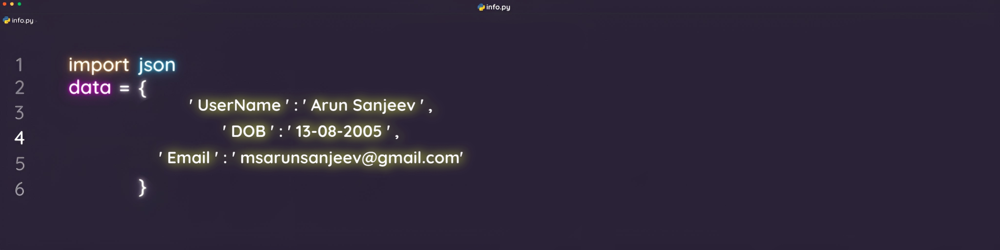

 

###

<h1 align="center">

[)](https://git.io/typing-svg)

</h1>

<h3 align="center">

</h3>

###

  

###

  

  
  
  
  

  

  
  <a href="https://www.instagram.com/arun_sanjeev._/" target="_blank">
    
    
    
    
 <!-- 
 
 
 <a href="https://leetcode.com/u/msarunsanjeev/" target="_blank">
     
    
    
    --->
    
  </a>
  
    
   
  

###

- 🔭 I’m Full Stack Developer from India.

- 🔥 I’m good at developing Software / Tools.

- 👨‍💻  For More About me [Visit My Portfolio ](https://arunsanjeevms.github.io/My-Personal-Portfolio/)

- 💬 Ask me about **Web Development, Cyber Security, Problem Solving**

- 📫 How to reach me **msarunsanjeev@gmail.com**

- ⚡ Fun fact  -- **Code is like humor. If it has to be explained, it’s not that good.”**

###
 
 

<h2 align="center">🛠  Tech Stack</h2>

#### 💻 Languages

  

#### 🌐 Frontend

  

#### ⚙️ Backend & Databases

  

#### 🚀 DevOps & Tools

  

#### 🎨 Design & IDE

  

---

###

###

<h2 align="center">🏅 Certification Badges</h2>

<marquee behavior="scroll" direction="left" scrollamount="6">
  &nbsp;&nbsp;&nbsp;
  &nbsp;&nbsp;&nbsp;
  &nbsp;&nbsp;&nbsp;
  &nbsp;&nbsp;&nbsp;
  &nbsp;&nbsp;&nbsp;
  &nbsp;&nbsp;&nbsp;
  &nbsp;&nbsp;&nbsp;
  &nbsp;&nbsp;&nbsp;
  &nbsp;&nbsp;&nbsp;
  &nbsp;&nbsp;&nbsp;
  &nbsp;&nbsp;&nbsp;
  &nbsp;&nbsp;&nbsp;
</marquee>

 

---

<h2 align="center">💭 Recent Blog Posts</h2>

  

  

###

# <h2 align="center"> Github Statistics</h2>

<!-- Row 1: 3 equal columns -->

<!-- Row 2: 2 equal columns (no table borders, freely aligned) -->

<!-- Row 3: Profile Details (left) + Activity Graph (right) -->

