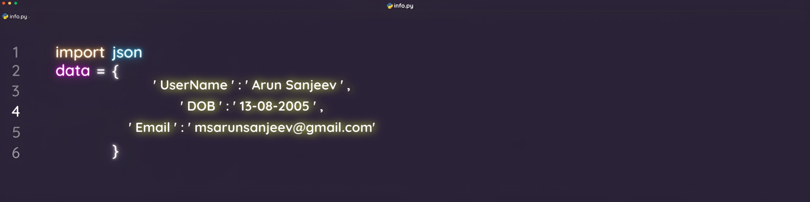

 

###

<h1 align="center">

[)](https://git.io/typing-svg)

</h1>

<h3 align="center">

</h3>

###

  

###

  </a>
  
  
  
  

  

  
  <a href="https://www.instagram.com/arun_sanjeev._/" target="_blank">
    
    
    
    
 <!-- 
 
 
 <a href="https://leetcode.com/u/msarunsanjeev/" target="_blank">
     
    
    
    --->
    
  </a>
  
    
   
  

###

- 🔭 I’m CSE Student from India.

- 🔥 I’m good at developing Software / Tools.

- 👨‍💻  For More About me [Visit My Portfolio ](https://arunsanjeevms.github.io/My-Personal-Portfolio/)

- 💬 Ask me about **Web Development, Cyber Security, Problem Solving**

- 📫 How to reach me **msarunsanjeev@gmail.com**

- ⚡ Fun fact  -- **Code is like humor. If it has to be explained, it’s not that good.”**

###
 
 

<h3 align="left">🛠  Stack I Work With :</h3>

###

  
  
  

  
  
       

  
  
  
    
 
  
  
  
  
  
  
  
  
  
  
  
  
  
  
    
     
      
      
      
  

  
  
       
 
  
  
 

 

###

<h3 align="left">🔥   My Github Stats :</h3>

###

  
  

---

###

###
## Certification Badges 🪶

<a href="#">

<a href="#">

<a href="#">

<a href="#">

<a href="#">

<a href="#">

<a href="#">

###

<h3 align="left">💭 A slice of my recent thoughts  :</h3>

###

   <a target="_blank" href="https://github-readme-medium-recent-article.vercel.app/medium/@msarunsanjeev/0"> 
  

<a target="_blank" href="https://github-readme-medium-recent-article.vercel.app/medium/@msarunsanjeev/1"> 

###
